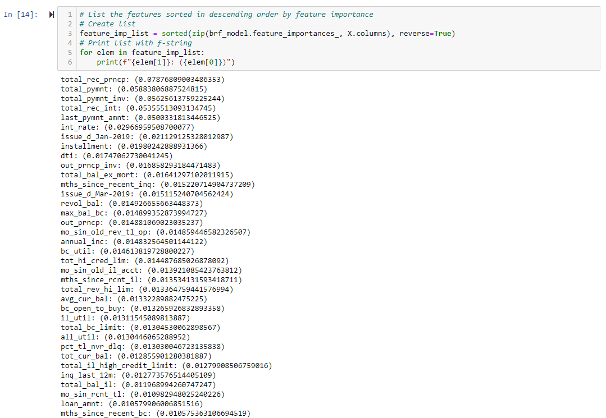

# Credit Risk Analysis

## Analysis Overview

This project used supervised machine learning to analyze credit risk. The overall purpose of the project was to develop machine learning (ML) models capable of determining credit risk for new loan applicants based on the applicant's financial history. The data used to train the model was contained contained labeled data from LendingClub. Since the data was labeled, i.e. the target variable (*loan_status*) was given, supervised ML was appropriate. The data was also highly unbalanced as low-risk loans significantly outnumbered high-risk loans. Therefore, various sampling techniques as well as ensemble classification was investigated to train a machine learning model to accurately predict credit risk. The scikit-learn and imbalanced-learn Python libraries were used in Jupyter Notebook to perform the analysis.

## Analysis Results

To begin the analysis, the dependencies were imported into the Jupyter Notebook, and the columns and target variable lists were created as shown in Fig. 1.

*Figure 1. Import initial libraries and create variable lists*

The CSV data was then loaded into a Pandas data frame as shown in Fig. 2.

*Figure 2. Load CSV data into Pandas data frame*

After loading the data into a data frame, the data was split into training and testing sets for the dependent and independent variables as shown in Fig. 3. In this case, *X* was used as the independent variable(s) and *y* was used as the dependent variable, *loan_status*.

*Figure 3. Split data into training and testing sets for the dependent and independent variables*

Notice in cell 7 of Fig. 3, the number of *low_risk* loans was 68470, and the number of *high_risk* loans was only 347. Due to this imbalance, various sampling techniques were used to train ML models. The first sampling technique investigated was Random Oversampling, or Naive Random Oversampling as shown in Fig. 4. This technique used the *RandomOverSampler* from the *over_sampling* class contained in the *imbalanced-learn* library. This technique randomly oversmaples the smaller minority class until it has enough data to match the size of the larger majority class.

*Figure 4. Train ML model using Random Oversampling*

After resampling the data, a logistic regression model was used to the fit the training data as shown in cell 10. Cells 11-13 show the performance of the logistic regression model comparing the test and predicted *y*-values. The balanced accuracy score is shown in cell 11, the confusion matrix is shown in cell 12, and the imbalanced classification report is shown in cell 13. Details of the model performance are summarized in the bulleted list at the end of this section.

Following investigation of Random Oversampling, the Synthetic Minority Oversampling Technique (SMOTE) was used to oversample the minority class. Instead of sampling values that already exist in the minority class to balance the data as in Random Oversampling, the SMOTE approach creates new (synthetic) data from the existing data in the minority class. In other words, Random Oversampling duplicates data that is already in the minority class, and SMOTE interpolates new data from the data that exists in the minority class. The code to perform the SMOTE approach is shown in Fig. 5.

*Figure 5. Train ML model using SMOTE*

As with Random Oversampling, logistic regression was used to train the ML model with the resampled data. The balanced accuracy score, confusion matrix, and imbalanced classification report are shown in cells 16, 17, 18, respectively. Details of the performance using SMOTE are summarized in the bulleted list at the end of this section.

Following investigation of oversampling techniques, the Cluster Centroid Undersampling technique was used to train a ML model to predict credit risk as shown in Fig. 6. The Cluster Centroid Undersampling method applies a clustering technique to the larger majority class in the dataset and takes a number of samples from this cluster to match the smaller minority class.

*Figure 6. Train ML model using Cluster Centroid Undersampling*

Logistic regression was used to train the undersampled model. The balanced accuracy score, confusion matrix, and imbalanced classification report are shown in cells 21, 22, and 23, respectively. Details for the model performance are summarized at the end of this section.

As a natural extension of the previous oversampling and undersampling techniques, the Synthetic Minority Oversampling Technique and Edited Nearest Neighbors (SMOTEENN) technique was used to combine oversampling and undersampling to resample the data. The first part of the SMOTEENN algorithm oversamples the smaller minority class using the SMOTE technique, and then the data is undersampled using the Edited Nearest Neighbors approach. The code to perform this analysis is shown in Fig. 7.

*Figure 7. Train ML model using SMOTEENN*

In line with pervious oversampling and undersampling approaches, logistic regression was used to fit an ML model to the data. The balanced accuracy score, confusion matrix, and imbalanced classification report are shown in cells 26, 27, and 28, respectively. Details of the model performance are summarized at the end of this section.

Following the investigation of oversampling and undersampling to resample data for ML models, ensemble classifiers to train ML models. The first ensemble classifier used was the Randome Forest classifier with 100 estimators. The Random Forest classifier essentially combines simple decision trees using a small set of features, or variables, from the dataset to create a model.

*Figure 8. Train ML model using Random Forest Classifier*

Figure 8 shows the balanced accuracy score, confusion matrix and imbalanced classification report are shown in cells 11, 12, and 13, respectively. Details of the Random Forest classifier are summarized at the end of this section.

One of the benefits of using the Random Forest classifier is the ability to observe the importance of each feature in the ML model. Figure 9 illustrates the features from the Random Forest model used in this analysis ranked by importance. In order to speed up the model, the top features could be used to generate a model which trades accuracy for speed.

*Figure 9. Random Forest feature list ranked by importance*

The Easy Ensemble classifier with 100 estimators was also used to train a ML model. The Easy Ensemble classifier is made of a collection of adaptive boost (AdaBoost) learners to create a strong learning method as described in the [EasyEnsembleClassifier](https://imbalanced-learn.org/stable/references/generated/imblearn.ensemble.EasyEnsembleClassifier.html)1 website.

The code to perform ML with the Easy Ensemble classifier is shown in Fig. 10.

*Figure 10. Train ML model using Random Forest Classifier*

The balanced accuracy score, confusion matrix, and imbalanced classification report are also in show in Fig. 10. Specifics for the Easy Ensemble classifier are summarized below.

The list below summarizes the performance of the ML models investigated in this project.

- Random Oversampling
    - Balanced Accuracy Score: 0.67
    - High-Risk Precision: 0.01
    - High-Risk Recall (Sensitivity): 0.70
    - Low-Risk Precision: 1.00
    - Low-Risk Recall (Sensitivity): 0.63

- SMOTE
    - Balanced Accuracy Score: 0.66
    - High-Risk Precision: 0.01
    - High-Risk Recall (Sensitivity): 0.63
    - Low-Risk Precision: 1.00
    - Low-Risk Recall (Sensitivity): 0.69

- Cluster Centroid Undersampling
    - Balanced Accuracy Score: 0.54
    - High-Risk Precision: 0.01
    - High-Risk Recall (Sensitivity): 0.69
    - Low-Risk Precision: 1.00
    - Low-Risk Recall (Sensitivity): 0.40

- SMOTEENN
    - Balanced Accuracy Score: 0.64
    - High-Risk Precision: 0.01
    - High-Risk Recall (Sensitivity): 0.71
    - Low-Risk Precision: 1.00
    - Low-Risk Recall (Sensitivity): 0.58

- Random Forest Classification
    - Balanced Accuracy Score: 0.79
    - High-Risk Precision: 0.03
    - High-Risk Recall (Sensitivity): 0.70
    - Low-Risk Precision: 1.00
    - Low-Risk Recall (Sensitivity): 0.87

- Easy Ensemble AdaBoost Classification
    - Balanced Accuracy Score: 0.93
    - High-Risk Precision: 0.09
    - High-Risk Recall (Sensitivity): 0.92
    - Low-Risk Precision: 1.00
    - Low-Risk Recall (Sensitivity): 0.94

## Analysis Summary

The balanced accuracy scores for the resampling techniques are in relatively close agreement with Oversampling, SMOTE, and SMOTEENN returning scores of 0.67, 0.66, and 0.64, respectively. Therefore, these three ML models predicted the correct credit risk more than 64% of the time on the test data. The balanced accuracy score for the Cluster Centroid approach was a bit lower at 0.54. The balanced accuracy scores for the ensemble classifiers were much higher with a score of 0.79 for the Random Forest classifier and a score of 0.93 for the Easy Ensemble classifier. Due to the imbalance and the lack of resampling with the ensemble classifiers, it is expected that the accuracy would be improved for these techniques compared to the resampling techniques. As a result, one cannot make a strong conclusion on the performance of one model over another. One could make the argument that of the resampling techniques, Cluster Centroid performed the worst in terms of accuracy, and of the ensemble techniques, Easy Ensemble outperformed Random Forest.

To gain more insight into the performance of each ML model, the precision and recall, or sensitivity, are investigated. The precision is not a useful metric for resampling techniques as all techniques returned a precision of 0.01 for high-risk loans and a precision of 1.00 for low-risk loans. This implies that for every 100 combinations of low-risk and high-risk loans, the resampling techniques would be expected to correctly identify only 1 high-risk loan. On the other hand, for every 100 combinations of low-risk and high-risk loans, the resampling techniques would correcly identify all of the low-risk loans. This means that the methods are overly agressive in identifying low-risk loans. The ensemble techniques fared only slightly better in terms of precision with the Random Forest classifier returning a high-risk precision of 0.03 and a low-risk precision of 1.00, and the Easy Ensemble classifier returning a high-risk precision of 0.09 and a low-risk precision of 1.00.

Investigation of the recall, or sensitivity, provides further insight into the performance of each model. The resampling methods returned high-risk sensitivities between 0.63 and 0.71, but there was a larger spread among low-risk sensitivities. The Random Oversampling and SMOTE techniques returned low-risk sensitivities 0.63 and 0.69, respectively while the Cluster Centroid and SMOTEENN techniques returned low-risk sensitivites of 0.40 and 0.58, respectively. The sensitivity is a measure of the ratio of true positives to the sum of true positives and false negatives, so this number essentially provides a measure of how responsive the model is to a true positive. All resampling techniques were fairly accurate in terms of high-risk loan prediction, but the Oversampling and SMOTE techniques were less likely to identify a loan as high-risk when it was in fact low-risk. It could be good to have a lower low-risk sensitivity in some circumstances, but it would also mean that fewer loans are issued resulting in lower revenue for the lending agency.

In general, the ensemble techniques outperformed resampling techniques in terms of sensitivity. The Random Forest classifier returned a high-risk sensitivity of 0.70 and a low-risk sensitivity of 0.87, while the Easy Ensemble classifier returned a high-risk sensitivity of 0.92 and a low-risk sensitivity of 0.94.

Based on the analysis in this project, the Easy Ensemble method is recommended to predict credit risk. While no model was highly superior to others in terms of balanced accuracy or precision, the Easy Ensemble method exhibited far better recall compared to the other ML methods. The improved recall, combined with good accuracy and slightly better high-risk precision, was the delineating factor that separated the Easy Ensemble classifier from the other ML methods.

## References
1. https://imbalanced-learn.org/stable/references/generated/imblearn.ensemble.EasyEnsembleClassifier.html